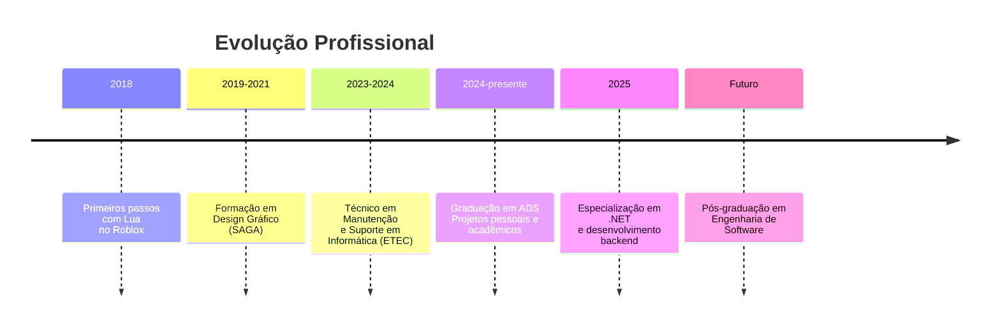

# Perfil Profissional

-   :material-account-circle:{ .lg .middle } **Informações Básicas**
    
    ---
    
    **Nome:** Isaque de Medeiros  
    **Idade:** 19 anos  
    **Localização:** São Paulo, Brasil  
    **Status:** Disponível para estágio e oportunidades júnior

-   :material-school:{ .lg .middle } **Formação**
    
    ---
    
    **Curso:** Análise e Desenvolvimento de Sistemas  
    **Instituição:** Centro Universitário  
    **Status:** Em andamento (conclusão 2026)  
    **Foco:** Engenharia de software e desenvolvimento web

-   :material-briefcase:{ .lg .middle } **Objetivo**
    
    ---
    
    **Cargo:** Desenvolvedor Full Stack Júnior  
    **Área:** Tecnologia da Informação  
    **Foco:** Desenvolvimento web, boas práticas, aprendizado contínuo

-   :material-translate:{ .lg .middle } **Idiomas**
    
    ---
    
    **Português:** Nativo  
    **Inglês:** Técnico (leitura e escrita avançadas)  
    **Espanhol:** Básico (em estudo)

---

## :material-account-details: Apresentação

Olá! Eu sou **Isaque de Medeiros**, estudante de Análise e Desenvolvimento de Sistemas com paixão por tecnologia e transformação digital. Minha trajetória combina formação técnica sólida com prática constante em projetos reais, sempre buscando evolução contínua e impacto positivo através do código.

### Filosofia de Trabalho
- **Qualidade sobre quantidade:** Código limpo, documentado e mantenível
- **Aprendizado contínuo:** Estudo diário e experimentação prática
- **Colaboração:** Trabalho em equipe e troca de conhecimento
- **Impacto:** Soluções que geram valor real para pessoas e negócios

---

## :material-chart-line: Trajetória Profissional

### Linha do Tempo

### Experiência Relevante

#### Desenvolvimento de Projetos Pessoais (2023-presente)
- **BSFM - Brazilian System of Food Metric:** Plataforma completa de nutrição inteligente com IA (.NET 8, PostgreSQL, YOLO)
- **Portfólio Pessoal:** Site profissional com foco em acessibilidade e performance
- **Projetos Acadêmicos:** PIM 1º Semestre e outros trabalhos de faculdade
- **Experimentos Técnicos:** Estudos em diferentes stacks e tecnologias

#### Formação Técnica (2023-2024)
- **ETEC - Técnico em Manutenção e Suporte em Informática**
  - Fundamentos de hardware e infraestrutura
  - Sistemas operacionais e redes
  - Suporte técnico e troubleshooting
  - Projeto final com nota máxima

#### Design Gráfico (2019-2021)
- **SAGA - School of Art, Game and Animation**
  - Fundamentos de design e composição visual
  - Ferramentas Adobe (Photoshop, Illustrator)
  - Interface e experiência do usuário
  - Contribuições para visão de front-end

---

## :material-cog: Habilidades Técnicas

### Linguagens de Programação

| Linguagem | Nível | Experiência |
| :--- | :--- | :--- |
| **HTML5** | :material-progress-check:{ style="color: #10b981" } Avançado | 3+ anos |
| **CSS3** | :material-progress-check:{ style="color: #10b981" } Avançado | 3+ anos |
| **JavaScript** | :material-progress-check:{ style="color: #3b82f6" } Intermediário | 2+ anos |
| **Python** | :material-progress-check:{ style="color: #3b82f6" } Intermediário | 2+ anos |
| **C#** | :material-progress-check:{ style="color: #3b82f6" } Intermediário | 1+ ano |
| **C++** | :material-progress-check:{ style="color: #f59e0b" } Básico | 1 ano |
| **Batch Script** | :material-progress-check:{ style="color: #f59e0b" } Básico | 1 ano |

### Front-end
- **HTML Semântico:** Estruturação acessível e SEO-friendly
- **CSS Moderno:** Flexbox, Grid, animações, variáveis CSS
- **Design Responsivo:** Mobile-first, media queries, breakpoints
- **Acessibilidade:** ARIA, contrastes, navegação por teclado
- **Performance:** Otimização, lazy loading, critical CSS

### Back-end e Lógica
- **Lógica de Programação:** Algoritmos, estruturas de dados
- **POO (Programação Orientada a Objetos):** Classes, herança, polimorfismo
- **APIs REST:** Consumo e criação de endpoints
- **Banco de Dados:** Modelagem, queries básicas, ORM
- **Arquitetura:** MVC, separação de concerns, clean code

### Ferramentas e Metodologias
- **Git e GitHub:** Versionamento, branches, pull requests
- **VS Code:** Editor principal com extensões produtivas
- **Figma/Adobe XD:** Prototipagem e design de interfaces
- **Metodologias Ágeis:** Conceitos básicos de Scrum/Kanban
- **Documentação:** README, comentários, guias técnicos

---

## :material-star: Projetos em Destaque

### BSFM - Brazilian System of Food Metric
**Stack:** .NET 8.0, PostgreSQL, YOLO AI, Tailwind CSS  
**Descrição:** Plataforma de nutrição inteligente com análise de alimentos por IA, dashboard personalizado e sistema de metas.  
**Contribuição:** Arquitetura completa, desenvolvimento full stack, integração de APIs externas.  
**Status:** :material-check-circle:{ style="color: #10b981" } Em produção

### Portfólio Pessoal
**Stack:** HTML5, CSS3, JavaScript, GitHub Pages  
**Descrição:** Site profissional com apresentação de trajetória, habilidades e projetos.  
**Contribuição:** Design, desenvolvimento, otimização de performance e acessibilidade.  
**Status:** :material-sync:{ style="color: #f59e0b" } Em evolução contínua

### PIM - 1º Semestre
**Stack:** HTML5, CSS3, JavaScript  
**Descrição:** Projeto acadêmico de desenvolvimento web com foco em estruturação semântica e responsividade.  
**Contribuição:** Desenvolvimento completo, deploy, documentação.  
**Status:** :material-check-circle:{ style="color: #10b981" } Publicado

---

## :material-target: Objetivos Profissionais

### Curto Prazo (2026)
1. **Consolidar experiência prática** em projetos Full Stack reais
2. **Atuar como estagiário ou júnior** em equipe de tecnologia
3. **Aprofundar conhecimentos** em JavaScript moderno e frameworks
4. **Contribuir para projetos open source** relevantes

### Médio Prazo (2027-2028)
1. **Especialização técnica** em backend (.NET/Node.js) ou frontend (React/Vue)
2. **Certificações profissionais** em cloud (AWS/Azure) e boas práticas
3. **Liderança técnica** em pequenos projetos ou features
4. **Mentoria** para outros desenvolvedores iniciantes

### Longo Prazo (2029+)
1. **Arquitetura de software** e decisões técnicas complexas
2. **Pós-graduação** em Engenharia de Software ou Ciência da Computação
3. **Contribuição significativa** para comunidade técnica brasileira
4. **Impacto social** através de tecnologia acessível e inclusiva

---

## :material-book: Formação Acadêmica

### Graduação
- **Curso:** Análise e Desenvolvimento de Sistemas
- **Instituição:** Centro Universitário
- **Período:** 2024-2026 (em andamento)
- **Foco:** Engenharia de software, banco de dados, desenvolvimento web, gestão de projetos

### Cursos Técnicos
1. **ETEC - Técnico em Manutenção e Suporte em Informática** (2023-2024)
   - Hardware e infraestrutura
   - Sistemas operacionais (Windows/Linux)
   - Redes e conectividade
   - Suporte técnico e helpdesk

2. **SAGA - School of Art, Game and Animation** (2019-2021)
   - Design gráfico e visual
   - Ferramentas Adobe Creative Suite
   - Fundamentos de animação
   - Interface e experiência do usuário

### Cursos Complementares
- **Algoritmos e Lógica de Programação** (DIO, Udemy)
- **Git e GitHub para Iniciantes** (DIO, freeCodeCamp)
- **HTML5 e CSS3 Modernos** (Origamid, Rocketseat)
- **JavaScript Básico ao Avançado** (DIO, freeCodeCamp)
- **Python para Data Science** (DIO, Kaggle)

---

## :material-heart: Valores Pessoais

### Profissionais
1. **Ética:** Transparência, honestidade e responsabilidade
2. **Qualidade:** Código limpo, testes, documentação
3. **Colaboração:** Trabalho em equipe, comunicação clara
4. **Aprendizado:** Curiosidade, experimentação, evolução constante

### Pessoais
1. **Resiliência:** Persistência diante de desafios
2. **Organização:** Planejamento, priorização, execução
3. **Empatia:** Colocar-se no lugar do usuário e do colega
4. **Impacto:** Contribuir para algo maior que si mesmo

---

## :material-download: Disponibilidade

### Tipo de Oportunidades
- :material-check-circle: **Estágio em desenvolvimento** (presencial/híbrido/remoto)
- :material-check-circle: **Júnior/Trainee** em tecnologia
- :material-check-circle: **Projetos freelance** sob avaliação
- :material-check-circle: **Colaboração em open source**

### Preferências
- **Modelo:** Preferência por híbrido ou remoto
- **Carga horária:** Integral ou meio período (flexível)
- **Início:** Imediato ou combinado
- **Localização:** São Paulo (capital) ou remoto

---

## :material-connection: Conecte-se

-   [:material-github: GitHub](https://github.com/Isaque-Medeiros)
    
    ---
    
    Repositórios públicos, projetos open source, contribuições técnicas e evolução do código.

-   [:material-linkedin: LinkedIn](https://www.linkedin.com/in/isaque-medeiros-a99421268/)
    
    ---
    
    Perfil profissional completo, experiência, conexões e artigos técnicos.

-   [:material-email: Email](mailto:medeiroisaque765@gmail.com)
    
    ---
    
    Contato direto para propostas, dúvidas técnicas ou conversas informais.

-   [:material-file-document: Portfólio](../index.md)
    
    ---
    
    Site pessoal com apresentação visual, projetos em destaque e trajetória detalhada.

---

:material-lightbulb: **Nota:** Este perfil é atualizado regularmente conforme novos projetos, aprendizados e experiências. Última atualização: Abril 2026.

*"O código é mais do que instruções para máquinas - é expressão de pensamento lógico, criatividade e solução de problemas."*