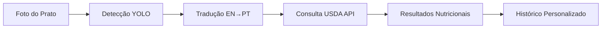

# Guia do Usuário - Introdução

Bem-vindo ao **BSFM (Brazilian System of Food Metric)**, a plataforma revolucionária de nutrição inteligente que utiliza inteligência artificial para transformar sua saúde alimentar.

## :material-play-circle: O que é o BSFM?

O BSFM é uma plataforma completa de análise nutricional que combina tecnologia de ponta com simplicidade de uso para ajudar você a:

- :material-camera: **Analisar alimentos** através de fotos com detecção por IA
- :material-chart-bar: **Acompanhar métricas** de saúde como IMC, TMB e gasto calórico
- :material-target: **Definir e alcançar metas** pessoais de peso e nutrição
- :material-hospital: **Conectar-se com serviços** de saúde e profissionais especializados
- :material-calendar: **Seguir planos alimentares** personalizados baseados no seu perfil

## :material-account-circle: Para quem é o BSFM?

### 👤 Pessoas comuns
Que desejam melhorar seus hábitos alimentares e ter mais controle sobre sua nutrição diária.

### 🏃 Atletas e praticantes de atividade física
Que precisam de acompanhamento nutricional preciso para otimizar performance e resultados.

### 🏥 Pacientes em tratamento
Que necessitam de monitoramento alimentar como parte de seu plano de saúde.

### 👨‍⚕️ Profissionais de saúde
Que buscam ferramentas modernas para apoiar o acompanhamento nutricional de seus pacientes.

## :material-rocket-launch: Primeiros Passos

### 1. Crie sua conta
Acesse a [página de cadastro](https://bsfm-app.railway.app/cadastro) e preencha seus dados básicos:
- Nome completo
- Email válido
- Senha segura
- Informações biométricas iniciais (peso, altura, idade, sexo)

### 2. Complete seu perfil
Após o cadastro, complete seu perfil com:
- Nível de atividade física (sedentário, ativo, muito ativo)
- Objetivos pessoais (perda de peso, ganho de massa, manutenção)
- Preferências alimentares e restrições

### 3. Explore o dashboard
Conheça as principais seções do seu painel pessoal:
- **Visão geral** com métricas principais
- **Gráficos de evolução** do peso e IMC
- **Histórico de análises** nutricionais
- **Metas e conquistas**

### 4. Faça sua primeira análise
Use a câmera do seu dispositivo para:
1. Acessar o **Analisador IA**
2. Fotografar seu prato de comida
3. Selecionar o tamanho da porção
4. Ver os resultados nutricionais instantâneos

## :material-star: Funcionalidades em Destaque

### Análise por IA em Tempo Real

**Benefícios:**
- Detecção de 452 alimentos diferentes
- Tradução automática para português
- Análise completa por 100g e por porção
- Histórico salvo para acompanhamento

### Dashboard Personalizado
- **Métricas calculadas automaticamente:**
  - IMC (Índice de Massa Corporal)
  - TMB (Taxa Metabólica Basal)
  - Gasto Calórico Total
  - Progresso em relação às metas

- **Visualizações interativas:**
  - Gráficos de linha para evolução do peso
  - Gráficos de barras para consumo nutricional
  - Indicadores de progresso coloridos

### Sistema de Metas Inteligentes
1. **Defina seu peso meta** com base em objetivos realistas
2. **Receba sugestões personalizadas** de plano alimentar
3. **Acompanhe seu progresso** com indicadores visuais
4. **Celebre conquistas** com sistema de badges e recompensas

## :material-cellphone: Acesso Multiplataforma

### 🌐 Navegador Web
Acesse pelo computador em [bsfm-app.railway.app](https://bsfm-app.railway.app)

### 📱 Dispositivos Móveis
- **Responsivo:** Interface adaptada para smartphones e tablets
- **PWA:** Instale como app nativo (em breve)
- **Offline:** Funcionalidades básicas disponíveis sem internet

## :material-shield-check: Segurança e Privacidade

### Proteção de Dados
- **Criptografia:** Todas as comunicações são HTTPS
- **Senhas:** Hash com BCrypt e salt automático
- **Dados pessoais:** Nunca compartilhados com terceiros
- **Conformidade:** Termos de uso e política de privacidade claros

### Controle do Usuário
- **Exportação:** Baixe seus dados em formato CSV/PDF
- **Exclusão:** Remova sua conta e dados permanentemente
- **Configurações:** Controle notificações e preferências

## :material-help-circle: Precisa de Ajuda?

### Recursos de Suporte
- **FAQ:** [Perguntas Frequentes](faq.md)
- **Tutoriais:** [Vídeos explicativos](https://youtube.com/playlist?list=exemplo)
- **Contato:** suporte@bsfm.com.br
- **Comunidade:** [Fórum de discussão](https://github.com/Isaque-Medeiros/BSFM/discussions)

### Solução de Problemas Comuns
| Problema | Solução |
| :--- | :--- |
| Não consigo fazer login | Verifique email/senha ou use "Esqueci senha" |
| Análise IA não detecta alimentos | Melhore iluminação e enquadramento da foto |
| Gráficos não atualizam | Aguarde alguns minutos ou recarregue a página |
| Email de verificação não chegou | Verifique spam ou solicite reenvio |

## :material-arrow-right: Próximos Passos

1. **Leia o guia completo** de [Primeiros Passos](getting-started.md)
2. **Experimente o** [Analisador IA](food-analysis.md)
3. **Configure suas** [Metas Pessoais](goals.md)
4. **Explore o** [Dashboard](dashboard.md) em detalhes

---

:material-lightbulb: **Dica:** Comece com uma análise simples (uma fruta ou um prato conhecido) para se familiarizar com a interface antes de análises mais complexas.

*Guia atualizado em Abril 2026 - Equipe BSFM*