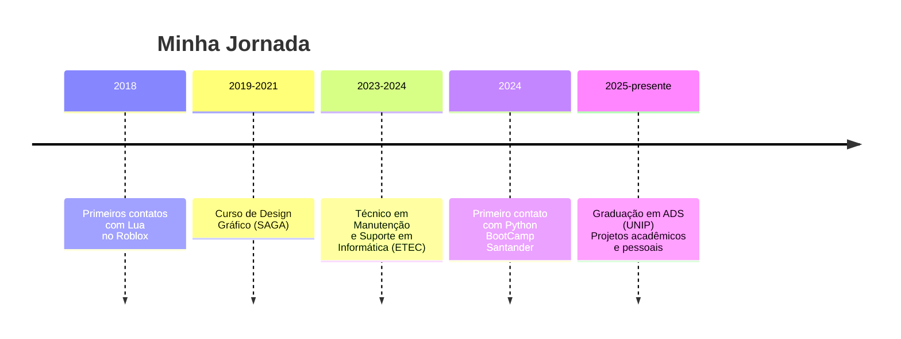

# Perfil

-   :material-account-circle:{ .lg .middle } **Informações Básicas**
    
    ---
    
    **Nome:** Isaque de Medeiros  
    **Idade:** 19 anos  
    **Localização:** São Paulo, Brasil  
    **Status:** Buscando estágio e oportunidades de aprendizado

-   :material-school:{ .lg .middle } **Formação**
    
    ---
    
    **Curso:** Análise e Desenvolvimento de Sistemas  
    **Instituição:** UNIP  
    **Período:** 2025 - 2026 (em andamento)  
    **Foco:** Desenvolvimento de software e programação

-   :material-briefcase:{ .lg .middle } **Objetivo**
    
    ---
    
    **Cargo:** Estagiário / Desenvolvedor Júnior  
    **Área:** Tecnologia da Informação  
    **Foco:** Aprendizado contínuo e desenvolvimento de soluções

-   :material-translate:{ .lg .middle } **Idiomas**
    
    ---
    
    **Português:** Nativo  
    **Inglês:** Técnico (leitura e escrita)  
    **Espanhol:** Básico

---

## :material-account-details: Apresentação

Olá! Eu sou **Isaque de Medeiros**, estudante de Análise e Desenvolvimento de Sistemas na UNIP. Minha trajetória começou na ETEC com o curso Técnico em Manutenção e Suporte em Informática (2023-2024), onde tive meu primeiro contato com programação. Atualmente estou no primeiro semestre da faculdade e busco minha primeira oportunidade profissional na área de tecnologia.

### Filosofia de Trabalho
- **Aprendizado contínuo:** Estudo diário e prática constante
- **Qualidade:** Código limpo e bem documentado
- **Colaboração:** Trabalho em equipe e troca de conhecimento
- **Honestidade:** Ser transparente sobre meu nível de conhecimento

---

## :material-chart-line: Trajetória

### Linha do Tempo

### Experiência

#### Projetos Pessoais e Acadêmicos (2024-presente)
- **BSFM - Brazilian System of Food Metric:** Plataforma de nutrição inteligente com IA (.NET 8, PostgreSQL, YOLO) - Em desenvolvimento
- **Portfólio Pessoal:** Site profissional com documentação de projetos
- **PIM 1º Semestre:** Projeto acadêmico integrador
- **Exercícios de Lógica:** Algoritmos e soluções em Python

#### Formação Técnica (2023-2024)
- **ETEC - Técnico em Manutenção e Suporte em Informática**
  - Fundamentos de hardware e infraestrutura
  - Sistemas operacionais e redes
  - Suporte técnico e troubleshooting
  - Primeiros contatos com C++ e Python

#### Design Gráfico (2019-2021)
- **SAGA - School of Art, Game and Animation**
  - Fundamentos de design e composição visual
  - Ferramentas Adobe (Photoshop, Illustrator)
  - Interface e experiência do usuário

---

## :material-cog: Habilidades Técnicas

### Linguagens de Programação

| Linguagem | Nível | Experiência |
| :--- | :--- | :--- |
| **HTML5** | :material-progress-check:{ style="color: #3b82f6" } Intermediário | 1+ ano (estudos) |
| **CSS3** | :material-progress-check:{ style="color: #3b82f6" } Intermediário | 1+ ano (estudos) |
| **JavaScript** | :material-progress-check:{ style="color: #f59e0b" } Básico | Estudos autônomos e acadêmicos |
| **Python** | :material-progress-check:{ style="color: #f59e0b" } Básico | Primeiro contato em 2024 |
| **C++** | :material-progress-check:{ style="color: #f59e0b" } Básico | Primeiro contato na ETEC (2023) |
| **SQL** | :material-progress-check:{ style="color: #f59e0b" } Básico | Consultas básicas |

### Front-end
- **HTML Semântico:** Estruturação de páginas web
- **CSS:** Flexbox, Grid, design responsivo
- **JavaScript:** Manipulação básica do DOM

### Back-end e Lógica
- **Lógica de Programação:** Algoritmos e estruturas de dados básicas
- **Python:** Scripts simples, automação básica
- **APIs:** Consumo básico de APIs REST

### Ferramentas
- **Git e GitHub:** Versionamento básico
- **VS Code:** Editor principal
- **Figma:** Noções de design de interfaces

---

## :material-star: Projetos

### BSFM - Brazilian System of Food Metric
**Stack:** .NET 8.0, PostgreSQL, YOLO AI, Tailwind CSS  
**Descrição:** Plataforma de nutrição inteligente com análise de alimentos por IA.  
**Status:** :material-sync:{ style="color: #f59e0b" } Em desenvolvimento

### Portfólio Pessoal
**Stack:** HTML5, CSS3, JavaScript, MkDocs  
**Descrição:** Site profissional com documentação de projetos.  
**Status:** :material-sync:{ style="color: #f59e0b" } Em evolução contínua

### PIM - 1º Semestre
**Stack:** Python, JSON, Interface Web  
**Descrição:** Projeto acadêmico integrador.  
**Status:** :material-check-circle:{ style="color: #10b981" } Concluído

---

## :material-target: Objetivos

### Curto Prazo (2026)
1. **Concluir a graduação** em ADS
2. **Conseguir estágio** na área de tecnologia
3. **Aprofundar** em JavaScript e Node.js
4. **Desenvolver portfolio** com projetos práticos

### Médio Prazo (2027-2028)
1. **Primeira experiência profissional** em desenvolvimento
2. **Certificações** em cloud computing
3. **Especialização** em backend ou frontend

### Longo Prazo (2029+)
1. **Arquitetura de software**
2. **Contribuição** para comunidade técnica
3. **Impacto social** através da tecnologia

---

## :material-book: Formação Acadêmica

### Graduação
- **Curso:** Análise e Desenvolvimento de Sistemas
- **Instituição:** UNIP
- **Período:** 2025-2026 (em andamento)

### Cursos Técnicos
1. **ETEC - Técnico em Manutenção e Suporte em Informática** (2023-2024)
2. **SAGA - School of Art, Game and Animation** (2019-2021) - Design Gráfico

### Cursos Complementares
- **BootCamp Santander** - Ciência de Dados com Python
- **BootCamp Bradesco** - Gen & IA
- **Microsoft Azure** - Curso avançado (conceitos de cloud)
- **Algoritmos e Lógica de Programação** - Plataformas online

---

## :material-download: Disponibilidade

### Tipo de Oportunidades
- :material-check-circle: **Estágio em desenvolvimento** (presencial/híbrido/remoto)
- :material-check-circle: **Júnior/Trainee** em tecnologia
- :material-check-circle: **Projetos acadêmicos** colaborativos

### Preferências
- **Modelo:** Presencial, híbrido ou remoto
- **Carga horária:** Flexível (conciliável com horários acadêmicos)
- **Localização:** São Paulo (capital) ou remoto

---

## :material-connection: Conecte-se

-   [:material-github: GitHub](https://github.com/Isaque-Medeiros)
    
    ---
    
    Repositórios públicos e projetos acadêmicos.

-   [:material-linkedin: LinkedIn](https://www.linkedin.com/in/isaque-medeiros-a99421268/)
    
    ---
    
    Perfil profissional e conexões na área de tecnologia.

-   [:material-email: Email](mailto:medeiroisaque765@gmail.com)
    
    ---
    
    Contato direto para propostas e oportunidades.

---

*Última atualização: Abril 2026*

*"Em constante aprendizado, buscando evoluir um pouco a cada dia."*
