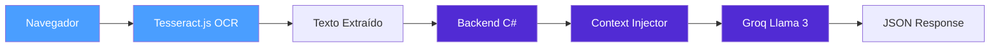

# BSFM.CoreAnalytics

O **BSFM.CoreAnalytics** é o módulo de análise de rótulos nutricionais do BSFM, implementado com **Split Architecture** para processamento seguro e eficiente.

---

## Visão Geral

O CoreAnalytics permite que usuários escaneiem tabelas nutricionais de produtos alimentícios usando a câmera do celular e recebam uma análise completa com feedback personalizado baseado em seu perfil de saúde.

### Arquitetura

### Princípio Fundamental

> **A imagem NUNCA sai do navegador.** Apenas o texto extraído via OCR local é enviado ao servidor.

Isso garante:
- ✅ **Privacidade**: Imagens de rótulos não são transmitidas
- ✅ **Performance**: Processamento OCR local, sem latência de upload
- ✅ **Segurança**: Dados sensíveis permanecem no dispositivo

### Componentes

| Componente | Localização | Função |
|------------|-------------|--------|
| **Tesseract.js** | Navegador (Web Worker) | OCR da tabela nutricional |
| **Pós-processamento** | Navegador | Correção de caracteres confusos |
| **NutriBrainService** | Backend C# | Motor Groq Llama 3 |
| **ContextInjectorService** | Backend C# | SystemPrompt personalizado |
| **RotuloController** | Backend C# | API endpoint |

### Fluxo Completo

1. **Usuário captura foto** da tabela nutricional
2. **Tesseract.js** executa OCR no navegador (Web Worker)
3. **Pós-processamento** corrige caracteres confusos (0→O, 1→l, etc.)
4. **Texto extraído** é enviado ao backend via POST
5. **Context Injector** monta SystemPrompt com dados do usuário
6. **Groq Llama 3** analisa e retorna JSON estruturado
7. **Resultado** é exibido com Health Score e recomendações

### Funcionalidades

- ✅ **OCR de tabelas nutricionais** com Tesseract.js
- ✅ **Detecção automática de produto** baseada no texto extraído
- ✅ **Health Score** (0-10) com regras restritivas
- ✅ **Feedback personalizado** baseado em diabetes e intolerâncias
- ✅ **Análise de macros** (calorias, proteínas, carboidratos, gorduras)
- ✅ **Alertas de sódio, açúcar e gorduras saturadas**
- ✅ **Dica BSFM** com sugestões de substituição

### Páginas desta Seção

- [NutriBrain Service](nutribrain.md) - Motor de IA Groq Llama 3
- [Context Injector](context-injector.md) - SystemPrompt personalizado
- [OCR e Tesseract](ocr-tesseract.md) - Processamento no navegador
- [Health Score](health-score.md) - Pontuação de saúde
- [Dados de Saúde](dados-saude.md) - Diabetes e intolerâncias
- [API de Rótulos](api-rotulos.md) - Endpoints e integração
