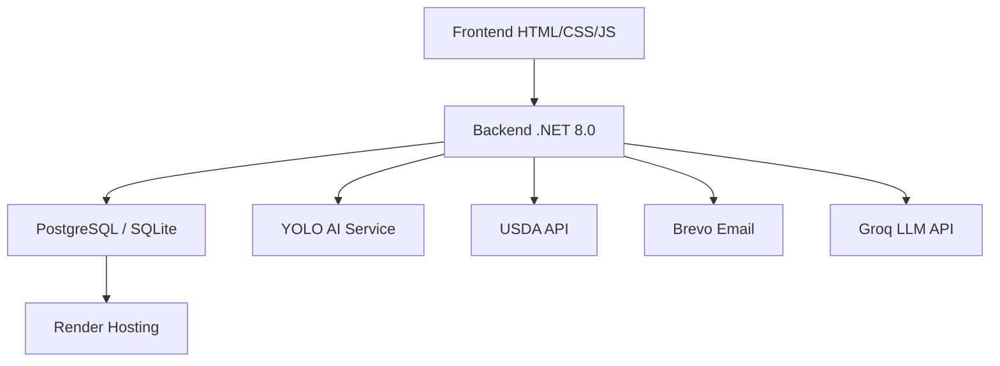
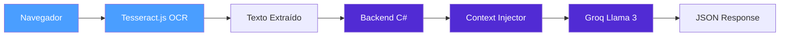

# Guia do Desenvolvedor BSFM

Bem-vindo ao Guia do Desenvolvedor do **BSFM (Brazilian System of Food Metric)**. Esta documentação fornece informações técnicas sobre a arquitetura, tecnologias, APIs e processos de desenvolvimento do protótipo.

---

## Arquitetura do Sistema

### Visão Geral

O BSFM segue uma arquitetura monolítica baseada em **.NET 8.0** com frontend servido estaticamente:



### Split Architecture - BSFM.CoreAnalytics

O módulo **BSFM.CoreAnalytics** implementa uma Split Architecture para análise de rótulos nutricionais:



**Princípio**: A imagem **NUNCA** sai do navegador. Apenas o texto extraído via OCR local é enviado ao backend.

### Stack Tecnológico

#### Backend (.NET 8.0)
- **Framework:** ASP.NET Core 8.0
- **Banco de Dados:** PostgreSQL (produção) / SQLite (desenvolvimento)
- **ORM:** Entity Framework Core 8.0 com Code-First
- **Autenticação:** BCrypt.Net-Next para hash de senhas + tokens de verificação
- **Email:** MailKit + MimeKit + Brevo API
- **IA (Visão):** YoloDotNet + ONNX Runtime para análise de alimentos
- **IA (Texto):** Groq API (Llama 3) para feedback nutricional personalizado
- **OCR:** Tesseract.js (processamento no navegador)

#### Frontend
- **Framework CSS:** Tailwind CSS 3.0 (via CDN)
- **Fontes:** Google Fonts (Inter + Outfit)
- **Ícones:** Font Awesome 6.4.0
- **Gráficos:** Chart.js
- **Mapas:** Leaflet.js
- **OCR:** Tesseract.js v5+ (Web Worker)
- **Design System:** Glassmorphism + Gradientes

#### APIs Externas
- **USDA FoodData Central API** - Dados nutricionais
- **Brevo API** - Serviços de email transacional
- **Groq API** - Inferência LLM (Llama 3) para feedback nutricional
- **YOLO Object Detection** - Reconhecimento de alimentos

---

## Setup Local

### Pré-requisitos

1. **.NET 8.0 SDK** - [Download oficial](https://dotnet.microsoft.com/download)
2. **PostgreSQL 15+** ou **SQLite** para desenvolvimento
3. **Visual Studio 2022** ou **VS Code** com extensão C#
4. **Git** para controle de versão

### Configuração do Ambiente

```bash
# 1. Clone o repositório
git clone https://github.com/Brazilian-System-of-Food-Metric/BSFM-APP.git
cd BSFM-APP

# 2. Restaure as dependências
dotnet restore

# 3. Configure variáveis de ambiente
set USDA_API_KEY=sua_chave_aqui
set BREVO_API_KEY=sua_chave_aqui
set GROQ_API_KEY=sua_chave_aqui
set DATABASE_URL=Host=localhost;Database=bsfm_dev;Username=bsfm_user;Password=senha

# 4. Execute a aplicação
dotnet run
```

### Estrutura do Projeto

```
MobileRepositorio/
├── BSFM.CoreAnalytics/              ← NOVO Módulo de análise de rótulos
│   ├── Frontend/
│   │   ├── analisador-rotulo.html   ← Página de escaneamento OCR
│   │   ├── tesseract-worker.js      ← Web Worker Tesseract.js
│   │   └── rotulo-processor.js      ← Pós-processamento OCR
│   ├── Backend/
│   │   ├── Services/
│   │   │   ├── NutriBrainService.cs      ← Motor Groq Llama 3
│   │   │   └── ContextInjectorService.cs ← SystemPrompt personalizado
│   │   ├── Models/
│   │   │   ├── RotuloRequest.cs
│   │   │   ├── RotuloResponse.cs
│   │   │   └── GroqApiModels.cs
│   │   └── Controllers/
│   │       └── RotuloController.cs
│   └── Tests/
│       ├── mock-ocr-data.json
│       └── test-prompt-groq.txt
├── Controllers/
│   ├── PlanoAlimentarController.cs
│   ├── UsuarioController.cs
│   └── AnaliseIAController.cs
├── Models/
│   ├── Usuario.cs
│   ├── AnaliseIA.cs
│   ├── bsfmv1_yolo_final.onnx
│   └── yolov10n.onnx
├── Services/
│   ├── LimpezaAnalisesServices.cs
│   ├── OcrNutricionalService.cs
│   ├── UsdaNutritionService.cs
│   └── YoloInferenceService.cs
├── wwwroot/
│   ├── analisador-ia.html
│   ├── dashboard.html
│   ├── diario.html
│   ├── hospitais.html
│   ├── index.html
│   ├── libras.html
│   ├── login.html
│   ├── metas.html
│   └── planos.html
├── ClassesBSFM.cs
├── PonteDB.cs
├── Program.cs
└── MeusApp.csproj
```

---

## Inteligência Artificial

### Modelo YOLO (Detecção de Alimentos)

O BSFM utiliza um modelo YOLO (You Only Look Once) para detecção de alimentos:

```csharp
public class YoloInferenceService
{
    private readonly Yolo _yolo;
    
    public YoloInferenceService()
    {
        var modelPath = Path.Combine("Models", "bsfmv1_yolo_final.onnx");
        _yolo = new Yolo(modelPath);
    }
    
    public List<DetectionResult> AnalyzeImage(IFormFile image)
    {
        using var stream = image.OpenReadStream();
        var results = _yolo.Predict(stream);
        
        return results.Select(r => new DetectionResult
        {
            Label = r.Label,
            Confidence = r.Confidence,
            BoundingBox = r.BoundingBox
        }).ToList();
    }
}
```

### Groq LLM (Feedback Nutricional)

O **NutriBrainService** integra com a API do Groq (Llama 3) para gerar feedback personalizado:

```csharp
public class NutriBrainService
{
    private const string GroqEndpoint = "https://api.groq.com/openai/v1/chat/completions";
    private const string ModeloPadrao = "llama3-70b-8192";
    
    public async Task<RotuloResponse> AnalisarRotuloAsync(
        string textoOcr, 
        string systemPrompt,
        CancellationToken ct = default)
    {
        // Monta payload com SystemPrompt + texto OCR
        // Envia para Groq API
        // Retorna JSON estruturado com análise nutricional
    }
}
```

### Context Injector (Personalização)

O **ContextInjectorService** monta um SystemPrompt personalizado com:
- Dados biométricos (IMC, TMB, TDEE)
- Histórico alimentar das últimas 48h
- Intolerâncias e diabetes
- Metas do usuário

### Fluxo de Análise Nutricional (Prato)

1. **Upload da imagem** do prato pelo usuário
2. **Detecção YOLO** dos alimentos presentes
3. **Tradução EN → PT** dos alimentos identificados
4. **Consulta USDA API** para dados nutricionais
5. **Cálculo por porção** baseado no tamanho selecionado
6. **Feedback Groq** com análise personalizada (Health Score)
7. **Persistência** no banco de dados
8. **Retorno dos resultados** ao usuário

### Fluxo de Análise de Rótulos (OCR)

1. **Usuário captura foto** da tabela nutricional
2. **Tesseract.js** executa OCR no navegador (Web Worker)
3. **Pós-processamento** corrige caracteres confusos
4. **Texto extraído** é enviado ao backend
5. **Context Injector** monta SystemPrompt personalizado
6. **Groq Llama 3** analisa e retorna JSON estruturado
7. **Resultado** é exibido com Health Score e recomendações

---

## API Reference

### Autenticação

#### `POST /solicitar-codigo`
Solicita código de verificação para cadastro.

**Request:**
```json
{
  "email": "usuario@exemplo.com"
}
```

**Response:**
```json
{
  "sucesso": true,
  "mensagem": "Código enviado para o email"
}
```

#### `POST /cadastrar-usuario-final`
Cadastra um novo usuário.

**Request:**
```json
{
  "nome": "João Silva",
  "email": "joao@exemplo.com",
  "senha": "SenhaSegura123",
  "codigo": "123456",
  "aceitaTermos": true
}
```

### Análise Nutricional

#### `POST /analisar-prato`
Analisa uma imagem de prato usando IA.

**Request (multipart/form-data):**
- `foto`: Arquivo de imagem (jpg, png)
- `porcao`: "pequeno", "medio", "grande"
- `usuarioId`: ID do usuário

**Response:**
```json
{
  "sucesso": true,
  "analise": {
    "id": 123,
    "alimentos": ["arroz", "frango"],
    "calorias": 450.5,
    "proteinas": 32.1,
    "carboidratos": 48.2,
    "gorduras": 12.3,
    "podeConsumir": true,
    "pontuacaoSaude": 7,
    "analiseEmRelacaoAMeta": "Ótima refeição! Boa distribuição de macros.",
    "dicaBSFM": "Experimente adicionar fibras com uma salada verde."
  }
}
```

#### `POST /api/rotulo/analisar`
Analisa texto OCR de rótulo nutricional via Groq LLM.

**Request:**
```json
{
  "usuarioId": 1,
  "textoOcr": "Valor Energético 200kcal... Carboidratos 30g..."
}
```

**Response:**
```json
{
  "produtoDetectado": "Bolacha Recheada",
  "podeConsumir": false,
  "pontuacaoSaude": 3,
  "analiseEmRelacaoAMeta": "ALERTA: Alto teor de sódio...",
  "dicaBSFM": "Experimente substituir por frutas...",
  "calorias": 200,
  "carboidratos": 30,
  "proteinas": 3,
  "gorduras": 8,
  "sodio": 450,
  "acucar": 15
}
```

### Dados de Saúde

#### `GET /api/saude/{id}`
Retorna dados de diabetes e intolerância do usuário.

#### `PUT /api/saude/atualizar`
Atualiza diabetes e intolerância do usuário.

**Request:**
```json
{
  "usuarioId": 1,
  "diabetes": "Tipo 2",
  "intolerancia": "Lactose"
}
```

### Consumo de Água

#### `POST /registrar-agua`
Registra consumo de água.

#### `GET /agua-diario/{usuarioId}`
Retorna consumo de água do dia.

#### `GET /agua-semanal/{usuarioId}`
Retorna consumo de água da semana.

#### `DELETE /remover-ultima-agua/{usuarioId}`
Remove o último registro de água do dia.

### Refeições Agendadas

#### `GET /refeicoes-semana/{usuarioId}`
Lista refeições agendadas do usuário.

#### `POST /salvar-refeicao-semana`
Salva uma refeição agendada.

#### `DELETE /remover-refeicao-semana/{id}`
Remove uma refeição agendada.

### Usuário

#### `GET /usuario/{id}`
Retorna dados completos do usuário.

#### `PUT /usuario/atualizar-nome`
Atualiza nome do usuário.

#### `PUT /usuario/atualizar-senha`
Atualiza senha do usuário.

#### `PUT /usuario/atualizar-data-nascimento`
Atualiza data de nascimento.

### Evolução

#### `GET /evolucao/{usuarioId}`
Retorna histórico de medições.

#### `POST /atualizar-medicao`
Registra nova medição (peso/altura).

#### `POST /definir-meta`
Define meta de peso.

### Health Check

#### `GET /health`
Verifica status da aplicação.

---

## Deploy no Render

### Arquivos de Configuração

O projeto inclui:

- **render.yaml**: Configuração Infrastructure as Code
- **Dockerfile**: Containerização da aplicação
- **Program.cs**: Configurado para ambiente de produção

### Variáveis de Ambiente Necessárias

```bash
# Banco de dados
DATABASE_URL=Host=...;Database=bsfm_prod;Username=bsfm_user;Password=...

# APIs externas
USDA_API_KEY=sua_chave_usda
BREVO_API_KEY=sua_chave_brevo
GROQ_API_KEY=sua_chave_groq

# Configuração da aplicação
ASPNETCORE_ENVIRONMENT=Production
```

### Health Check Endpoint

```csharp
[ApiController]
[Route("health")]
public class HealthController : ControllerBase
{
    private readonly PonteDB _db;
    
    public HealthController(PonteDB db)
    {
        _db = db;
    }
    
    [HttpGet]
    public async Task<IActionResult> Get()
    {
        try
        {
            await _db.Database.CanConnectAsync();
            return Ok(new 
            {
                status = "healthy",
                timestamp = DateTime.UtcNow,
                database = "connected"
            });
        }
        catch (Exception ex)
        {
            return StatusCode(503, new 
            {
                status = "unhealthy",
                error = ex.Message
            });
        }
    }
}
```

---

## Segurança

### Hash de Senhas com BCrypt

```csharp
public class SegurancaService
{
    public string HashSenha(string senha)
    {
        return BCrypt.Net.BCrypt.HashPassword(senha);
    }
    
    public bool VerificarSenha(string senha, string hash)
    {
        return BCrypt.Net.BCrypt.Verify(senha, hash);
    }
}
```

### Configuração CORS

```csharp
// Program.cs
builder.Services.AddCors(options =>
{
    options.AddPolicy("AllowAll",
        builder => builder
            .AllowAnyOrigin()
            .AllowAnyMethod()
            .AllowAnyHeader());
});
```

### Migrações Automáticas

O sistema realiza migrações automáticas no startup para adicionar colunas necessárias:

- **Diabetes**: Coluna na tabela Usuarios
- **Intolerancia**: Coluna na tabela Usuarios
- **PodeConsumir, PontuacaoSaude, AnaliseEmRelacaoAMeta, DicaBSFM**: Colunas na tabela AnalisesIA

---

## Contribuindo

### Processo de Contribuição

1. **Fork** o repositório
2. **Crie uma branch** para sua feature
   ```bash
   git checkout -b feature/nova-funcionalidade
   ```
3. **Commit** suas mudanças
   ```bash
   git commit -m "feat: adiciona nova funcionalidade"
   ```
4. **Push** para a branch
   ```bash
   git push origin feature/nova-funcionalidade
   ```
5. **Abra um Pull Request**

### Convenções de Código

#### Commits Semânticos
- `feat:` Nova funcionalidade
- `fix:` Correção de bug
- `docs:` Documentação
- `style:` Formatação de código
- `refactor:` Refatoração
- `test:` Testes
- `chore:` Manutenção

---

**Última atualização:** 01 de Maio de 2026  
**Mantido por:** Equipe BSFM - UNIP
